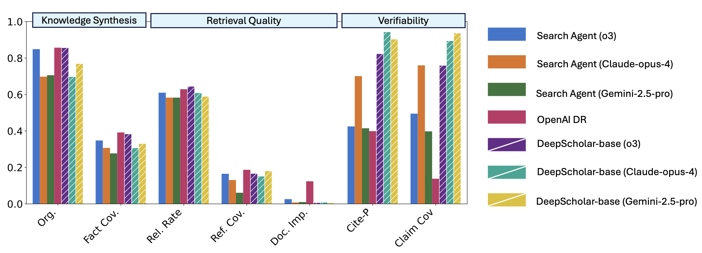

# DeepScholar Base

DeepScholar Base is our reference pipeline for research synthesis. Built on top of the [LOTUS framework](https://github.com/lotus-data/lotus) for LLM-powered data processing, it leverages semantic operators, which provide a rich-set of primitives for LLM-based data processing. This allows DeepScholar to achieve competitive performance with OpenAI's DeepResearch, while running 2x faster.




## Quickstart

```python
from deepscholar_base import deepscholar_base
from deepscholar_base.configs import Configs
from lotus.models import LM
from datetime import datetime
import asyncio

# Set configs
configs = Configs(
    lm=LM(model="gpt-4o", temperature=1.0, max_tokens=10000)
)

# Advanced configs - use different LMs for different stages
# configs = Configs(
#    search_lm=LM(model="gpt-4o", temperature=0.7),      # For query generation & agentic search
#    filter_lm=LM(model="gpt-4o-mini", temperature=0),   # For semantic filtering
#    taxonomize_lm=LM(model="gpt-4o", temperature=0.5),  # For categorization
#    generation_lm=LM(model="gpt-4o", temperature=0.7),  # For summaries & report
# )

# Run deepscholar_base with your query
async def main():
    final_report, docs_df, stats = await deepscholar_base(
        topic="What are the latest developments in retrieval-augmented generation?",
        end_date=datetime(2025, 1, 1),
        configs=configs,
    )
    print(final_report)

asyncio.run(main())
```

## How It Works

The pipeline takes a **research topic** (and optionally an **end date** to limit searches to papers before a certain date—useful for reproducibility or backdating research) and produces a **Markdown report** with categorized references, summaries, and inline citations.

### Pipeline Overview

```
            ┌────────┐    ┌────────┐    ┌───────────┐    ┌──────────┐    ┌──────────┐    
 (INPUT) ─▶ │ SEARCH │ ─▶ │ FILTER │ ─▶ │ SUMMARIZE │ ─▶ │TAXONOMIZE│ ─▶ │ DETAILED │ ─▶ (OUTPUT)
  topic     │        │    │        │    │           │    │          │    │ INSIGHTS │     report
 end_date   │ Gather │    │  Keep  │    │ Generate  │    │ Group by │    │ Extract  │   references
            │ papers │    │relevant│    │ background│    │ category │    │ key idea │    
            └────────┘    └────────┘    └───────────┘    └──────────┘    └──────────┘    
```

## Search Modes

#### Agentic Search (`use_agentic_search=True`, default)

An autonomous AI agent with tools that iteratively searches and reads papers until it has enough context. The agent decides what to search, which results to read in detail, and when to stop.

```
         ┌──────────────── AI AGENT ────────────────┐
         │ (uses up to 100 autonomous turns)        │
         │  Tools:                                  │
         │   • search_arxiv()    • search_web()     │
         │   • read_abstracts()  • read_webpages()  │
         └────────────────┬─────────────────────────┘
                          │
         ┌────── Agent: decides what to search ─────┐
         │       what to read, when done            │
         └───────────────┬──────────────────────────┘
                         │
            ┌── Synthesize & return references ──┐
```

#### Recursive Search (`use_agentic_search=False`)

A structured multi-step approach where the LLM generates queries, searches multiple corpuses in parallel, and uses accumulated results to generate better queries in subsequent iterations.

```
Step 1                    Step 2                    Step N
──────                    ──────                    ──────
Generate queries    ─▶    Generate queries    ─...-▶    Generate queries
       │                  (informed by              (informed by
       ▼                   background)               background)
Search arXiv/web                │                        │
       │                        ▼                        ▼
       ▼                  Search arXiv/web         Search arXiv/web
Summarize background            │                        │
       │                        ▼                        ▼
       └──────────────▶   Summarize background ─...-▶  Final output
```

Both modes support an optional `end_date` parameter that filters results to only include papers published before that date. Web search can be disabled with `enable_web_search=False` to search only arXiv.


## Configuration Reference

### Search Settings

| Parameter | Default | Description |
|-----------|---------|-------------|
| `use_agentic_search` | `True` | Use autonomous AI agent for search (vs structured recursive search) |
| `enable_web_search` | `True` | Include web results via Tavily alongside arXiv |
| **(Only for recursive search)** | | |
| `per_query_max_search_results_count` | `10` | Maximum results to fetch per query |
| `max_search_retries` | `3` | Retries if search+filter yields no results |
| `num_search_steps` | `3` | Iterations for recursive search (ignored if agentic) |
| `num_search_queries_per_step_per_corpus` | `2` | Queries per step in recursive search |
| `web_corpuses` | `[TAVILY]` | Web search providers for recursive search |
| **(Only for agentic search)** | | |
| `use_responses_model` | `None` | Force OpenAI Responses vs Chat Completions API |

### Filter Settings

| Parameter | Default | Description |
|-----------|---------|-------------|
| `use_sem_filter` | `True` | Apply semantic relevance filtering |
| `use_sem_topk` | `True` | Rank and select top-K papers |
| `final_max_results_count` | `30` | Max papers after filtering |

### Generation Settings

| Parameter | Default | Description |
|-----------|---------|-------------|
| `categorize_references` | `True` | Organize papers into thematic categories |
| `generate_category_summary` | `True` | Write summary paragraphs per category |
| `generate_insights` | `True` | Extract key ideas from each paper |
| `use_structured_output` | `True` | Use Pydantic models for LLM outputs |

### Language Model Settings

You can provide a single `lm` parameter, which will be used as the default for all stages. Alternatively, you can specify different models for each stage to optimize for cost, speed, or capability:

| Parameter | Purpose |
|-----------|---------|
| `lm` | Default LM used when stage-specific LMs aren't provided |
| `search_lm` | Query generation and agentic search reasoning |
| `filter_lm` | Semantic filtering and ranking |
| `taxonomize_lm` | Category creation and paper-to-category mapping |
| `generation_lm` | Introduction, summaries, insights, and final report |

## Output

The pipeline returns a tuple of three values:

1. **`final_report`** (str): The complete Markdown document ready for display or export
2. **`docs_df`** (DataFrame): All filtered papers with columns: `id`, `title`, `url`, `snippet`, `date`, `authors`, `category`, `key idea/summary`
3. **`stats`** (dict): Detailed statistics including per-stage token usage, intermediate results, and any errors
